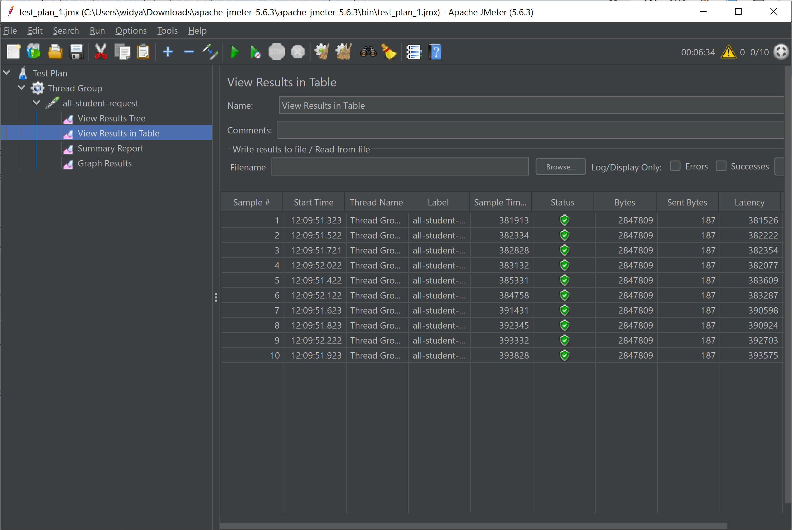
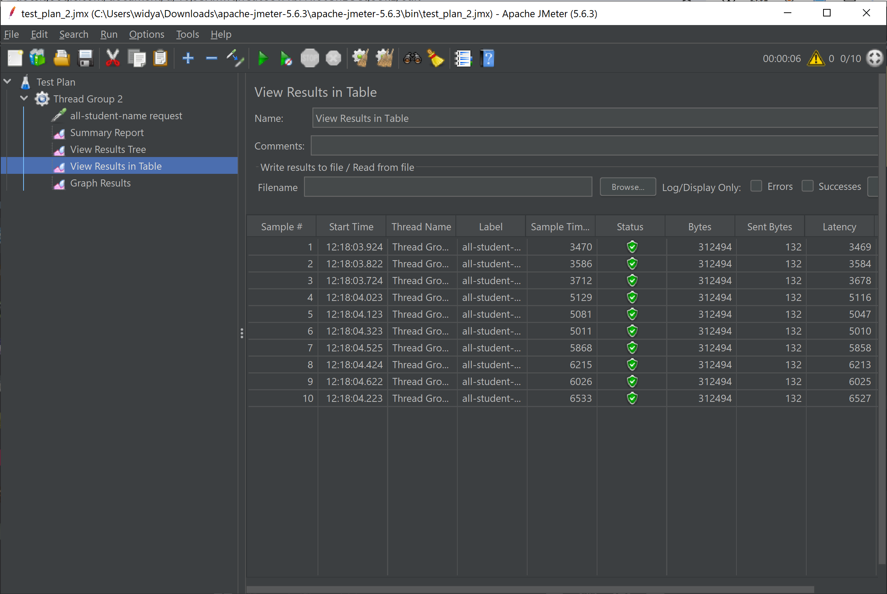
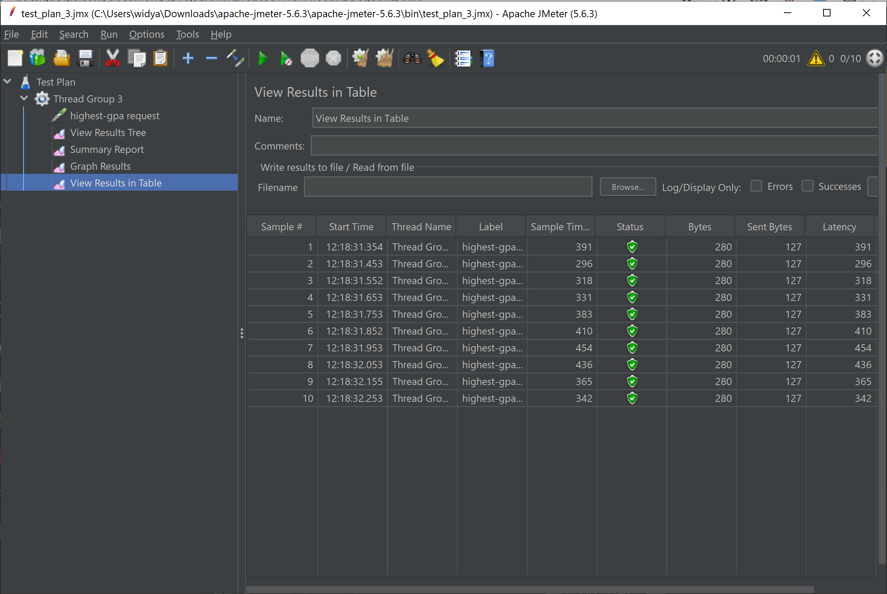
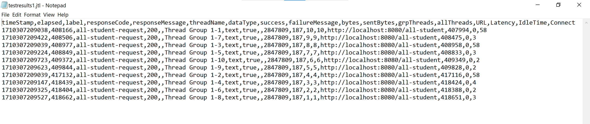
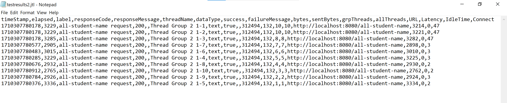
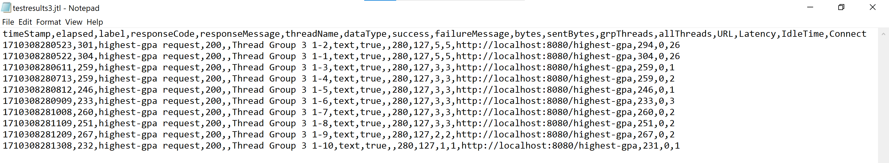
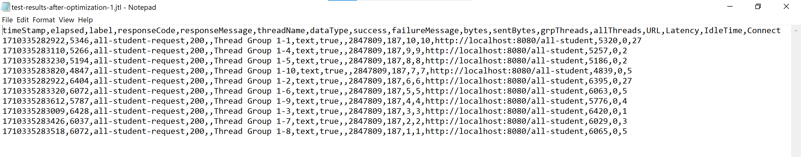
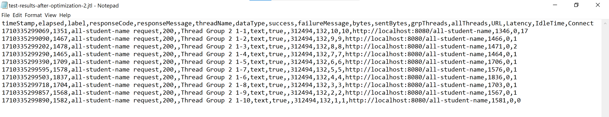
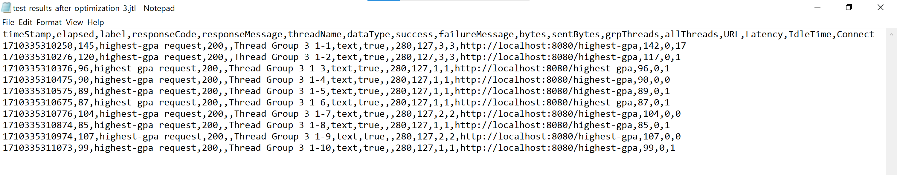

# Modul 5
### Hasil Test Sebelum Optimisasi

### Hasil Test Setelah Optimisasi

Dari hasil test-test di atas, dapat terlihat bahwa performa aplikasi setelah optimisasi jauh lebih baik. Salah satu
loncatan paling jauh adalah pada test `/all-student`. Sebelum optimisasi, _request_ tersebut membutuhkan sekitar 400
detik. Setelah optimisasi, _request_ tersebut hanya membutuhkan sekitar 6 detik. Hasil perbaikan juga dapat dilihat pada
_endpoint_ lain, seperti dari 3 detik menjadi 1.5 detik untuk `/all-student-name` dan dari 0.3 detik menjadi 0.1 detik
untuk `/highest-gpa`.

### Refleksi
1. Perbedaan JMeter dengan IntelliJ Profiler \
_Testing_ dengan JMeter tidak mempedulikan detail aplikasinya sendiri. _Testing_ dengan JMeter dapat dianggap sebagai
    penggunaan aplikasi dari perspektif pengguna. Di sisi lain, _testing_ dengan IntelliJ Profiler fokus pada identifikasi
    metode-metode apa saja dalam aplikasi yang menyebabkan performa lambat. Dengan itu, seorang _programmer_ dapat mengidentifikasi
    masalah dengan lebih cepat.
2. Manfaat _profiling_ \
Dengan _profiling_, seorang _programmer_ dapat mengidentifikasi mana bagian aplikasinya yang menyebabkan performa yang
    buruk atau lambat. Setelah mengetahui metode-metode saja yang belum optimal, _programmer_ dapat menganalisisnya lebih
    lanjut untuk mencari tahu masalahnya. 
3. Efektivitas IntelliJ Profiler \
Iya, menurut saya IntelliJ Profiler sangat membantu dalam mengidentifikasi metode-metode mana saja yang masih dapat dioptimalkan.
    IntelliJ Profiler menyediakan sebuah _flame graph_ yang dapat mengarahkan _programmer_ kepada metode-metode yang memakan
    banyak waktu. Walau tidak ada jaminan bahwa metode-metode tersebut dapat dioptimalkan, setidaknya _programmer_ memiliki
    arahan awal untuk mengoptimisasi kodenya.
4. Tantangan dalam Melakukan _Performance Testing_ \
Menurut saya, tantangan paling sulit dalam melakukan _performance testing_ adalah membaca data _testing_-nya sendiri, baik
    data yang dihasilkan oleh JMeter maupun IntelliJ. Sebagai contoh, _flame graph_ yang ditawarkan oleh IntelliJ sangat
    membantu dalam mengidentifikasi metode-metode lambat, tetapi membacanya sendiri memerlukan usaha dari sisi _programmer_.
    Pada awalnya, saya tidak terlalu paham bagaimana mengartikan _flame graph_ karena yang saya lihat hanyalah semacam _bar graph_
    dengan nama-nama metode pada _bar_-nya.
5. Manfaat IntelliJ Profiler \
Dengan menggunakan sebuah _profiler_, kita dapat lebih mudah mengidentifikasi bagian mana saja dalam kode kita yang merupakan
    _bottleneck_ dan menahan bagian-bagian lain dari kinerja maksimalnya. Tentu ini sangat bermanfaat karena setelah metodenya
    diidentifikasi oleh _profiler_, kita dapat melihatnya lebih lanjut dan mencari tahu bagaimana cara mengoptimisasikannya.
6. Menangani Kemungkinan Perbedaan Hasil antara JMeter dengan IntelliJ Profiler \
Sejauh ini, saya belum menemukan hasil yang bertolak belakang antara JMeter dengan IntelliJ Profiler. Salah satu contoh yang
    saya dapat pikirkan di mana hal ini dapat terjadi adalah di mana aplikasi kita mulai lambat saat dikirimi _request_ yang
    sangat banyak dalam satu waktu. Dalam kasus ini, JMeter akan melaporkan hasil yang buruk karena aplikasi kita memang tidak
    bisa meng-_handle_ _load_ yang tinggi pada kenyataannya. Namun, IntelliJ Profiler bisa-bisa saja melaporkan hasil yang baik
    karena IntelliJ Profiler hanya bekerja dengan satu _request_ dalam satu waktu. Karena itu, penting untuk seorang _programmer_
    memahami apa yang sebenarnya membuat aplikasinya lambat.
7. Strategi Optimisasi \
Setelah diidentifikasi metode mana saja yang menahan kinerja program, saya mulai melihat sebenarnya apa yang dilakukan oleh
    metode tersebut. Saya ingin mencari tahu apakah ada hal-hal seperti pemanggilan metode yang berlebihan atau yang tidak diperlukan,
    pemanggilan metode dengan kompleksitas tinggi, atau penggunaan struktur data yang tidak cocok. Setelah mencari tahu hal-hal
    tersebut, saya mulai mencari tahu alternatif apa saja yang tersedia. Terakhir, saya implementasikan
    alternatif-alternatif tersebut.